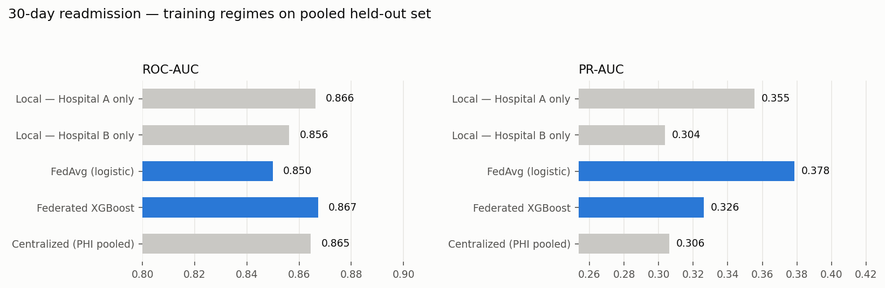

# ReadmitRadar

Predicts **30-day hospital readmission risk at discharge** — with an architecture
where PHI never leaves the hospital network. FHIR R4 input, federated training
across two simulated hospitals, SHAP explanations, a local-LLM clinical rationale,
a two-agent AutoGen deliberation, and self-hosted Langfuse tracing (with an
LLM-as-judge grading every generation), surfaced in a Panel dashboard with a
sortable, risk-ranked patient roster.

**Stack:** XGBoost · Federated Learning (FedAvg) · FHIR R4 · SHAP · AutoGen ·
Langfuse (self-hosted) · LM Studio · Panel

## Results (pooled held-out set: 2,902 admissions, patient-level split)

Data: **Synthea** synthetic patients — 15,014 adult inpatient admissions across
two simulated hospital systems (Massachusetts / Texas runs), 30-day readmission
label derived from each patient's real encounter sequence (~10% base rate).
29 features per admission, including vitals (BP), a lipid panel, HbA1c, and CBC
labs alongside utilization history and comorbidities.

| Training regime | ROC-AUC | PR-AUC | Recall |
|---|---|---|---|
| Local — Hospital A only | 0.866 | 0.356 | 0.623 |
| Local — Hospital B only | 0.856 | 0.304 | 0.626 |
| **Federated XGBoost** | **0.867** | **0.326** | **0.669** |
| FedAvg (logistic) | 0.850 | 0.378 | 0.150 |
| Centralized (PHI pooled — privacy-violating baseline) | 0.865 | 0.306 | 0.758 |

Federated XGBoost matches (and in this run slightly exceeds) the centralized
upper bound without a single patient record crossing hospital boundaries, and
beats both single-site models. The cross-site effect is real: Hospital A's
local model drops from **0.866 to 0.841 ROC-AUC** when scored only on
Hospital B's patients.

The model displayed in the UI ("Risk %") is **probability-calibrated**
(Platt scaling on a held-out calibration split — see `ml/model.py`): mean
predicted risk lines up with the actual ~10% base rate, rather than the
raw ranking score `scale_pos_weight` training produces on its own.



## Pipeline

```
FHIR R4 Bundle ─► fhir/parser ─► feature row ─► federated XGBoost ─► risk score
                                                     │                (calibrated)
                                                SHAP values
                                                     │
                     LM Studio (local Mistral) ─► clinical rationale
                                                     │
                  AutoGen: Clinician ⇄ Risk Analyst deliberation
                                                     │
                                              Panel dashboard
        (every LLM call traced + LLM-judge-scored in self-hosted Langfuse
                              — fully on-prem)
```

The dashboard (`ui/app.py`) has three pages: an **Overview** with cohort-level
risk distribution and a plain-English explanation of what the scores and
training regimes mean, a **Patients** roster (sortable/filterable, color-coded
by risk band, click a row for that patient's full risk breakdown), and an
ad-hoc **Score a FHIR Bundle** page for pasting an arbitrary bundle.

## Quickstart

```bash
pip install -r requirements.txt
python scripts/run_synthea.py       # Synthea: both hospital populations (needs Java)
python scripts/prepare_synthea.py   # → storage/*.csv with 30-day labels
python scripts/train.py             # all regimes + metrics + chart
python scripts/predict_demo.py      # FHIR bundle → risk → SHAP → note
panel serve ui/app.py --show        # dashboard
pytest                              # 28 tests, no network or Java needed
```

Optional (both local, both free): start **LM Studio** with a Mistral-7B-Instruct
model for real clinical notes, AutoGen deliberation, and LLM-as-judge scoring;
set **Langfuse** (self-hosted) keys in `.env` for tracing. Without them, the
pipeline still runs — LLM output falls back to deterministic templates that are
clearly labeled as such, and tracing/judging become no-ops.

## FHIR Resource Catalog

The parser (`fhir/parser.py`) is the system's real input path — the dashboard and
demo accept a FHIR R4 `Bundle` (type `collection`) and consume exactly these
resources:

| Resource | Fields read | Used for |
|---|---|---|
| `Patient` | `gender`; `extension[urn:readmitradar:age-years]` | demographics (age carried as an extension: de-identified data has no real DOB) |
| `Encounter` | `length.value`; `hospitalization.dischargeDisposition` | length of stay; discharge to skilled nursing facility |
| `Condition` | `code.coding` (ICD-10-CM: `I50.9`, `J44.9`, `E11.9`, `N18.9`) | comorbidity flags (CHF, COPD, T2DM, CKD) |
| `Observation` | `code.coding` + `valueQuantity` — LOINC `3094-0`/`6299-2` (BUN), `2160-0`/`38483-4` (creatinine), `2951-2`/`2947-0` (sodium), `718-7` (hemoglobin), `2345-7`/`2339-0` (glucose), `8480-6` (systolic BP), `8462-4` (diastolic BP), `2093-3` (total cholesterol), `2085-9` (HDL), `18262-6` (LDL), `2571-8` (triglycerides), `4548-4` (HbA1c), `6298-4` (potassium), `6690-2` (WBC), `777-3` (platelets); local system `urn:readmitradar:measure` for utilization counts | discharge labs, vitals, and lipid/CBC panel; prior admissions, ED visits, medication/diagnosis counts, Charlson index, follow-up flag |

Several labs (BUN, creatinine, sodium, glucose) are recorded by Synthea under
two interchangeable LOINC codes depending on which panel ordered them ("in
Blood" vs "in Serum or Plasma") — both are treated as the same measurement.

Unknown resource types are ignored; incomplete bundles fail loudly with every
missing feature listed (`BundleParseError`), never silently imputed.

## HIPAA Architecture Decisions

Every component placement below is forced by the constraint that **PHI cannot
leave the hospital network** (HIPAA Privacy/Security Rules; Safe Harbor
de-identification is not assumed):

1. **No cloud LLM.** Clinical rationale generation sees lab values, comorbidities
   and utilization history — PHI under HIPAA. It runs on **LM Studio** (local
   Mistral-7B via an OpenAI-compatible API on `localhost`), so prompt payloads
   never cross the network boundary.
2. **Federated learning instead of data pooling.** No single hospital has enough
   readmissions to train a robust model, but pooling records between covered
   entities is a disclosure. In FedAvg only **model parameters** cross the wire
   (weight vectors for the logistic model; boosted-tree margins for XGBoost) —
   never patient rows. The "centralized" regime exists in the comparison purely
   as the upper bound federated learning is measured against.
3. **Self-hosted observability.** LLM tracing (latency, token usage, drift) runs
   on **Langfuse self-hosted** — trace payloads contain PHI-derived prompts, so a
   SaaS tracing backend would be a business-associate disclosure. Tracing is also
   fail-open: if Langfuse is down, care-team workflows are unaffected.
4. **LLM-as-judge on every generation.** Every clinical note and deliberation
   turn is graded by a second local LM Studio call (`observability/judge.py`)
   against a 4-dimension rubric — **groundedness** (no invented clinical
   facts), **clarity**, **actionability**, and **safety** (decision support,
   not diagnosis) — each scored 1-5 and attached directly to that
   generation's Langfuse trace (`judge-groundedness`, `judge-clarity`, etc.).
   This is how the prompt templates in `llm/clinical_note.py` and
   `llm/deliberation.py` are validated, not just eyeballed: open any trace in
   Langfuse and its judge scores sit right next to it. Judging is diagnostic
   only — a failed or unparseable judge call is silently skipped and never
   blocks the pipeline.
5. **Honest FedAvg for trees.** Gradient-boosted trees have no dense weight vector
   to average. True FedAvg (multi-round, sample-weighted client weight averaging —
   McMahan et al. 2017) is implemented on a logistic model; the XGBoost
   federation aggregates per-hospital boosters by margin averaging. Both are
   labeled as what they are in `ml/federated.py`.

## Dataset

Patient data comes from **[Synthea](https://github.com/synthetichealth/synthea)**,
the open-source synthetic patient generator (no credentialing, no PHI — every
record is simulated but clinically realistic). Two independent runs model the two
hospital systems: **Massachusetts** (Hospital A) and **Texas** (Hospital B), so
the cross-site case-mix difference is a real population effect, not an artifact.

```bash
# one-time: put synthea-with-dependencies.jar (GitHub releases) in tools/
python scripts/run_synthea.py --population 2500   # both hospital runs
python scripts/prepare_synthea.py                 # → storage/*.csv
```

`data/synthea_loader.py` derives each admission's **30-day readmission label**
from the patient's actual encounter sequence, builds the discharge features
(utilization history, active conditions/medications, last labs before
discharge), splits train/test **by patient**, and reports lab-imputation rates
in `reports/synthea_dataset_stats.json`. A fast self-contained generator
(`data/synthetic.py`) still backs the unit tests, so `pytest` needs no Java
and no dataset.

## Project layout

```
config.py            paths + env-driven settings
data/                Synthea loader (real pipeline) · fast synthetic generator (tests)
fhir/                R4 resources · Bundle builder · Bundle parser
ml/                  feature schema · XGBoost wrapper · federated regimes · SHAP
llm/                 LM Studio client · clinical note · AutoGen deliberation
observability/       Langfuse tracer (no-op when unconfigured) · LLM-as-judge rubric scoring
scripts/             run_synthea · prepare_synthea · train · predict_demo · generate_data (test data)
ui/app.py            Panel dashboard
tests/               28 unit tests (FHIR round-trip, federated math, SHAP, Synthea labels)
```
